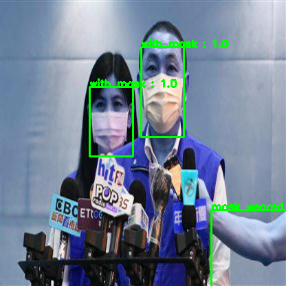
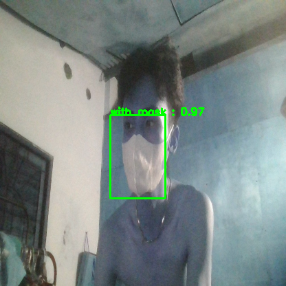

# yolo-v3-by-tensorflow

## install package
> pip install -r requirements.txt

## Training model: [model.h5](https://drive.google.com/file/d/1s-yeFvDI54ixLgIbfbxGSFRpSGR_buWf/view?usp=sharing)
> python3 training.py
ban có thể sử dụng model của tôi huấn luyện trước để sử dụng inference.

## inference: model.h5
> python3 inference.py

## resultset

