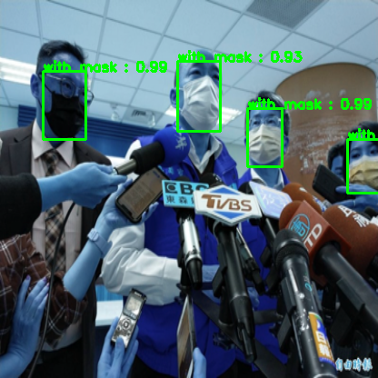

# yolo-v3-by-tensorflow

## install package
> pip install -r requirements.txt

## Cấu trúc của dũ liệu:

## Training model: [model.h5](https://drive.google.com/file/d/1XPIFrhRkrPI-nixMoh3Jp9KXxdRVca8_/view?usp=sharing) Khoảng 700MB.
> python3 training.py

ban có thể sử dụng model của tôi huấn luyện trước để sử dụng inference. sau đó ngay trong thư mục hiện hành bạn chạy file inference.py để chạy demo xem trước.
    - bạn có thể thêm các dữ liệu ảnh vào trong folder test/images/*

> python3 inference.py

## inference: model.h5
> python3 inference.py

## resultset

- AP for class 'with_mask': 0.8531
- AP for class 'without_mask': 0.6263
- AP for class 'mask_weared_incorrect': 0.4489
- Mean Average Precision (mAP) @0.5 IoU: 0.6428

## Nhận xét từ chính bản thân:

- Dữ liêu: face-mask-detection ở trên kaggle với dữ liệu khá lệch với with-mask(cao), mithout-mask (trung bình), mask_weared_incorrect(rất thấp). Từ đó khiến mô hình ko dữ đoán chính xác được các vật thể của mask_weared_incorrect. nên sử dụng các kỷ thuật đẻ cân bằng nhãn như phạt nằng vào các nhãn có tỉ lệ thấp và thấp với nhãn có tỉ lệ cao.
- Dữ liệu được load và xử lý bằng numpy. vì thế ko thể tạo đồ thị tính toán của tensorflow. Vì thế lúc khởi động huấn luyện thì nó mất 1 lúc lâu để tạo luồng dữ liệu.
- Loss cho box: là GIOU.
- Sử dụng các kỉ thật để đa dạng hóa dữ liêu như: scale, rotate, tranlation,... trong github này ko sử dụng mosaic đó là kỉ thuật gép 4 ảnh thành 1 ảnh được sử dụng với tỉ lệ 100% trong yolo_v8. Đây là 1 kỉ thuật cực kì tốt.

## tài liệu tham khảo:

 - [TensorFlow 2 YOLOv3 Mnist detection training tutorial](https://pylessons.com/YOLOv3-TF2-mnist): chủ blog nói rất rõ về lý thuyết và code mẫu.
 - [GitHub repository](https://github.com/pythonlessons/TensorFlow-2.x-YOLOv3): đây là github của tác giả về yolo-v3 và v4. tuy nhiên phiên bản mà tác giả sủ dụng là tensorflow 1.0 (phiên bản tiền nhiệm).
 - [YOLOv3: An Incremental Improvement](https://arxiv.org/pdf/1804.02767): paper.
 - [yolov3 explained](https://wikidocs.net/181713): 1 blog về yolo v3 v4 rất chi tiết về lý thuyết và thực hành (sử dụng 1 package sẳn để huấn luyện).

## Cộng sự
    